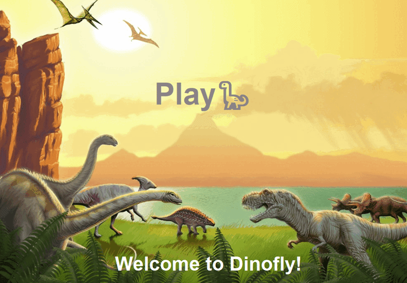
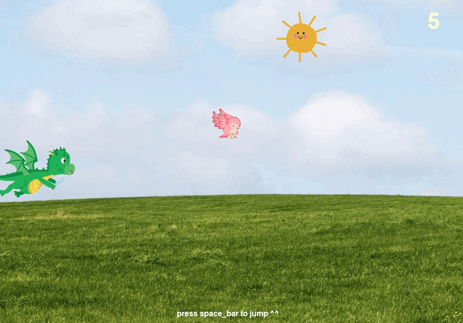
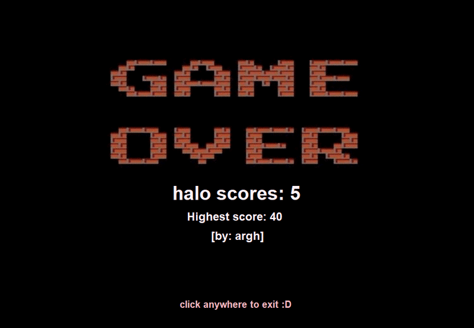

# DINOFLY 🦕
* Freshman computer programming's annual project
#### ✰✰✰✰✰✰✰✰✰✰✰✰✰✰✰✰✰✰✰✰✰✰✰✰✰✰✰✰
## Overview

* Dinofly is a game inspired by the familiar dinosaur game found in **Google Chrome**. However, it brings a fresh twist 
to the table. In Dinofly, your dinosaur has taken to the skies, allowing you to navigate obstacles and earn five 
points for successfully passing each one.

### ❤️ Welcome page

* The welcome page is your entry point to the game. Simply click the "PLAY" button in the center of the page. 
A pop-up will prompt you to enter your name to proceed to the main game screen.
        

  
### ❤️ Playing

* Once you've entered your name, the main game screen will appear. Your goal is to control the dinosaur, making it 
jump to avoid obstacles and stay alive as long as possible. You'll earn five points for each successful obstacle 
clearance. Obstacles will become progressively faster as you accumulate more points.
  

### ❤️ Game over

* When you collide with an obstacle, the game over screen will display your score, the current high score, 
* and the player who achieved it.
  

### Required

*  `turtle`, `Turtle`, `random`, `screen`, and `json`

### Program design

* __7 classes__

1. class `Vector` is a class to help set position of other classes(other turtles)

2. class `Dinosaur` is a class where we create the actual dinosaur which I imported the image of the dinosaur and 
   make the dinosaur jump which is `dinofly`. Nevertheless, I also put the __gravity__ so that when the dinosaur jumps it
   will fall down slowly.
   

3. class `Bird` has a duty to store coordinate which is __position__ and render the shape.

4. class `Cactus` has a duty to store coordinate which is __position__ and render the shape.

5. class `Interface` mostly create the turtles and texts that will appear in main screen.

6. class `Stage` is the most important class because it is the class where all the __classes__ and __attributes__ are
   combined and gather to make the gameplay. In this class, we store the score, create the screen, json file, and make
   the turtle runs.

7. class `Display` is where the user will run this program. In this class, we import the previous class which is stage
  and in this class we make the code becomes short and understandable. Furthermore, in this class I use this class
  to make the obstacles in for-loop to append those objects into __list of objects__ in stage.
      
* To run the game, execute `display.py`.

### Data storage

* The game uses a JSON file.
    - `users.json` used to keep track of the user's name and user's score.
